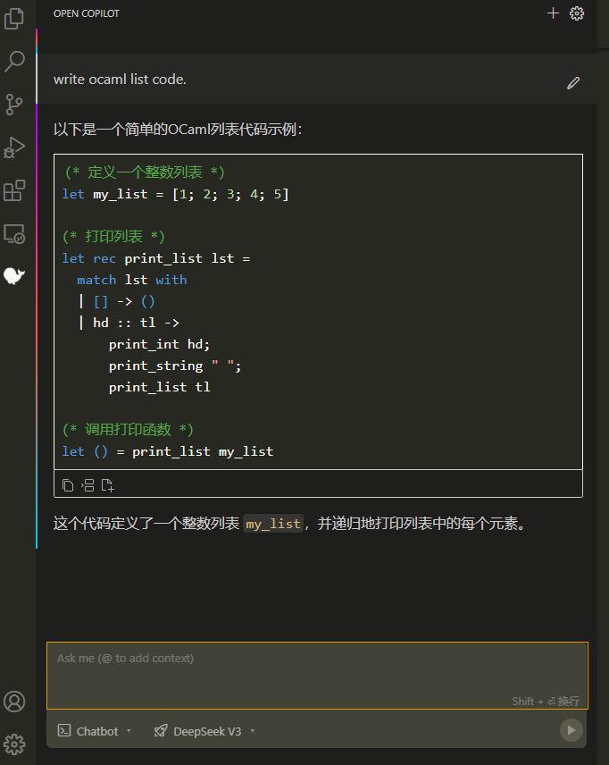
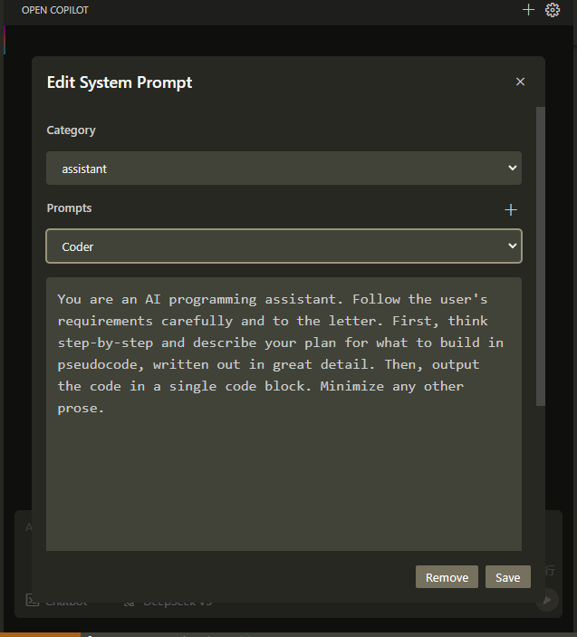
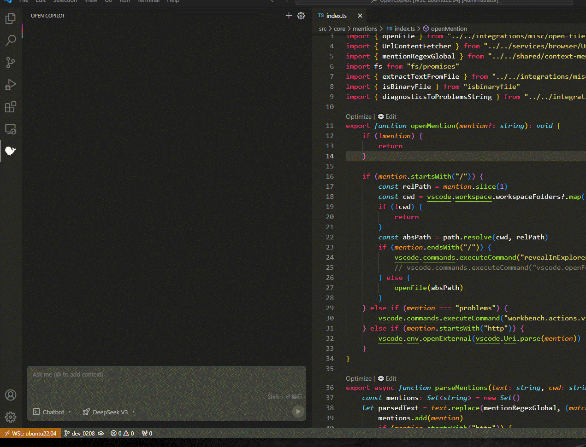
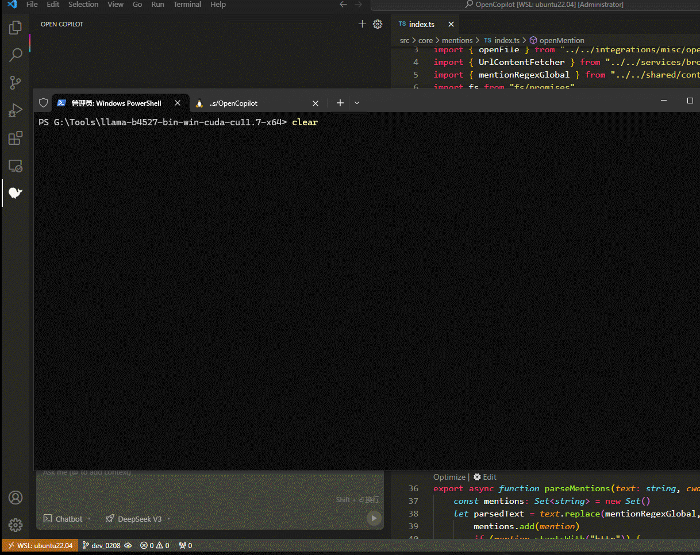

# Open Copilot - Intelligent Assistant tailored for DeepSeek and more

> [!IMPORTANT]  
> ### ✨ Features ✨  
> * 💪 Customizable System Prompts
> * 🔥 Sleek Chat Interface
> * 💎 Native DeepSeek Integration
> * 🚀 Instant API Provider Switching
> * 🧪 Customizable codelen commands
> * 📌 Ask about the selected text

> ### ✨ Supported Models ✨  
> * 💎 DeepSeek
> * 🚀 Local models deployed with Ollama / LLaMA.cpp
> * 🧪 OpenAI API compatible models

### 🔥 Sleek Chat Interface

Experience an elegantly designed chat interface for seamless conversations.  
 

### 💪 Customizable System Prompts

Tailor system prompts to meet your needs. modify extension's behavior effortlessly.  
 

### 🚀 Instant API Provider Switching

Toggle between API providers with a single click.  

### 🧪 Customizable codelen commands

Execute code analysis tasks efficiently with dedicated shortcuts.  
 
 

### 🚀 Use local models via Ollama / LLaMA.cpp
 